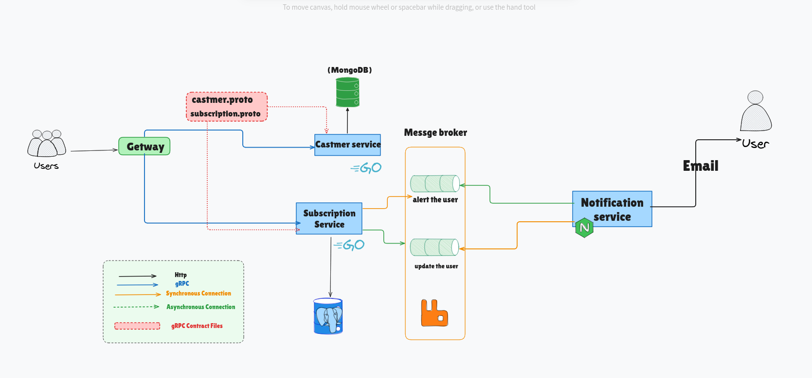

# 🧩 Distributed Subscription Reminder System

This project implements a microservices-based system using **Go**, **RabbitMQ**, **gRPC**, and **Node.js** to handle subscription tracking and notifications. It follows an event-driven approach where services communicate asynchronously via a message queue.

---

## 🚀 Services & Ports

| Service               | Tech       | Port             |
|----------------------|------------|------------------|
| Gateway              | Go + gRPC  | `localhost:8000` |
| Customer Service     | Go + gRPC  | `localhost:8081` |
| Subscription Service | Go + gRPC  | `localhost:8082` |
| Notification Service | Node.js    | `localhost:3000` |
| RabbitMQ Broker      | RabbitMQ   | `localhost:5672` |

---

## 🔧 Make Commands

These commands simplify running and managing services:

```bash
make getway
# → Run the Gateway service (Air)

make castmer
# → Run the Customer Service (Air)

make subscription
# → Run the Subscription Service (Air)

make notification
# → Run the Notification Service (Nodemon)

make generate proto_name=name
# → Compile proto file to Go gRPC code

make work file_name=MyService proto_name=myproto
# → Init Go module & link to Go workspace

```
---
# ⚙️ Technology Stack

| Component                | Technology             |
| ------------------------ | ---------------------- |
| Core Logic               | Go                     |
| Message Queue            | RabbitMQ               |
| Notifications            | Node.js                |
| Scheduler                | robfig/cron/v3         |
| Communication            | gRPC REST API          |
| Database (Users)         | MongoDB                |
| Database (Subscriptions) | PostgreSQL             |
| Dev Tools                | Air, Nodemon, Makefile |
